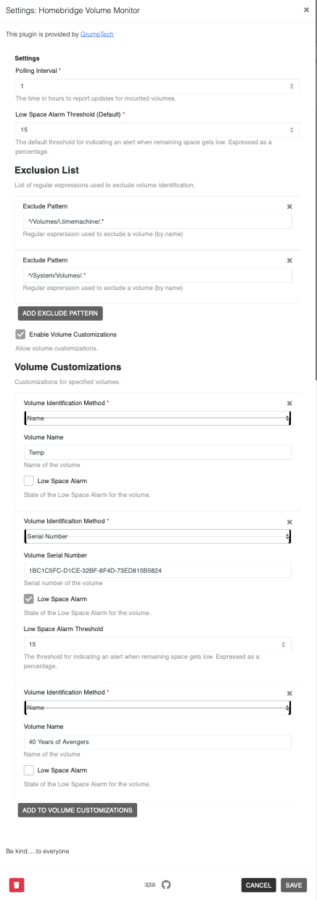

# Homebridge Volume Monitor

[Homebridge Volume Monitor](https://github.com/pricemi115/homebridge-grumptech-volmon), by [GrumpTech](https://github.com/pricemi115/), is a [Homebridge](https://homebridge.io) dynamic platform plug-in that publishes the remaining storage of mounted volumes on macOS/OSX operating systems to Homekit. The remaining storage, computed as a percentage of the total, is presented as a _Battery Service_ accessory. A _low battery alert_ will be issued when the remaining storage falls below a specified threshold.
## Installation

This plug-in is intended to be used with the [homebridge-config-ui-x](https://www.npmjs.com/package/homebridge-config-ui-x) homebridge management tool. If using _homebridge-config-ui-x_, simply search for _homebridge-grumptech-volmon_ for installation, plug-in management, and configuration.

To install the plugin manually:
 _`npm install -g homebridge-grumptech-volmon`_

## Configuration
### _homebridge-config-ui-x_
This plugin is best experienced when running as a module installed and managed by the [_homebridge-config-ui-x_](https://www.npmjs.com/package/homebridge-config-ui-x) plugin. When running under homebridge-config-ui-x, visiting the plugin settings will allow you to change the polling interval and the low space alarm threshold, as shown below. 

| Setting | Description | Units | Default | Minimum | Maximum |
| :------:| :------:| :------:| :------:| :------:| :------: |
| Polling Interval | The time between automatic scans of the system | hours | 1 | 0.083334 | 744 |
| Low Space Alarm Threshold | Percent of remaining space that will trigger a _low battery_ alert | percent | 15 | 1 | 99 |
 

Additionally, especially if this system will be running other homebridge modules, it is strongly encouraged to run this plugin as an isolated child bridge. This setting page can be found by clicking on the _wrench_ icon on the plugin and then selecting _Bridge Settings_. With the child bridge enabled, revisiting the setting page after homebridge is rebooted will show a QR code for pairing to the child bridge. The username (mac address) and port are randomly generaged by homebridge-config-ui-x. 

### Manual Configuration
If you would rather manually configure and run the plugin, you will find a sample _config.json_ file in the `./config` folder. It is left to the user to get the plugin up and running within homebridge. Refer to the section above for specifics on the configuration parameters.
## Usage
When the plugin-starts, it will clear out the _battery service_ accessories detected from a prior run. It will then scan the system and create a _battery service_ accessory for each visibe (_located in `/Volumes`_) volume. The _battery level_ got each accessory will be set to the percentage of storage space remaining on the volume. If the amount of remaining storage is below the _alert threahold_ the accessory will show the _low battery_ status. 
When viewing the details of an accessory, the accessory information section will display the _Volume UUID_ (if known) under the _Serial Number_ field and the _volume format_ under the _Model_ field. The plug-in version will show under the _Firmware_ field. 

The volumes on the system will be rescanned peropdically according to the polling interval specified in the configuration settings. Any volumes that have been dismounted or are no longer in `/Volumes` will show the battery level and battery alert as _Not Reachable_. Homekit applications will render these _not reachable_ differently. For example, the Apple Home app will simply not display the Battery Level and Low Battery Status. Other applications like [Home+ 5](https://apps.apple.com/us/app/home-5/id995994352) app shows the accessories as _Error_.

The plug-in also publishes a _Switch_ accessory with a default name of _Refresh_. Turning this switch to the on state, will iniitate a re-scan of the volumes on the system. The user is not permitted to turn the switch off. It will automatically turn off when the scan is complete. This allows the user to update the _battery service_ accessories without needing to wait for the polling interval to expire.
## Restrictions
This module operates by using shell commands to the `diskutil` program. Therefore, this module is only supported on the Apple OSX and macOS operating systems.

## History

Version | Release Date | Comments
------: | :----------: | :-------
0.0.5   | 2021-FEB-20 | Initial release to npm
0.0.6   | 2021-FEB-23 | Big fix(es) and minor documentation updates.
0.0.7   | 2021-FEB-23 | Repository cleanup
0.0.8   | 2021-FEB-27 | Issue#3 and other changes/improvements.
1.0.0   | 2021-MAR-01 | Release v1
## Known Issues and Planned Enhancements
Refer to the bugs and enhancements listed [here](https://github.com/pricemi115/homebridge-grumptech-volmon/issues)
## Contributing

1. Fork it!
2. Create your feature/fix branch: `git checkout -b my-new-feature`
3. Commit your changes: `git commit -am 'Add some feature'`
4. Push to the branch: `git push origin my-new-feature`
5. Submit a pull request

## Credits

Many thanks to all the folks contributing to [Homebridge](https://homebridge.io) and to [oznu](https://github.com/oznu) for [homebridge-config-ui-x](https://www.npmjs.com/package/homebridge-config-ui-x), allowing for the possibility of this sort of fun and learning.

## License

Refer to [LICENSE.md](./LICENSE.md) for information regarding licensincg of this source code.